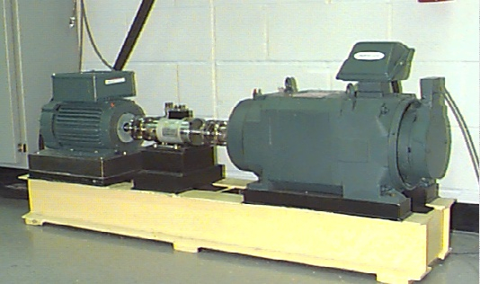
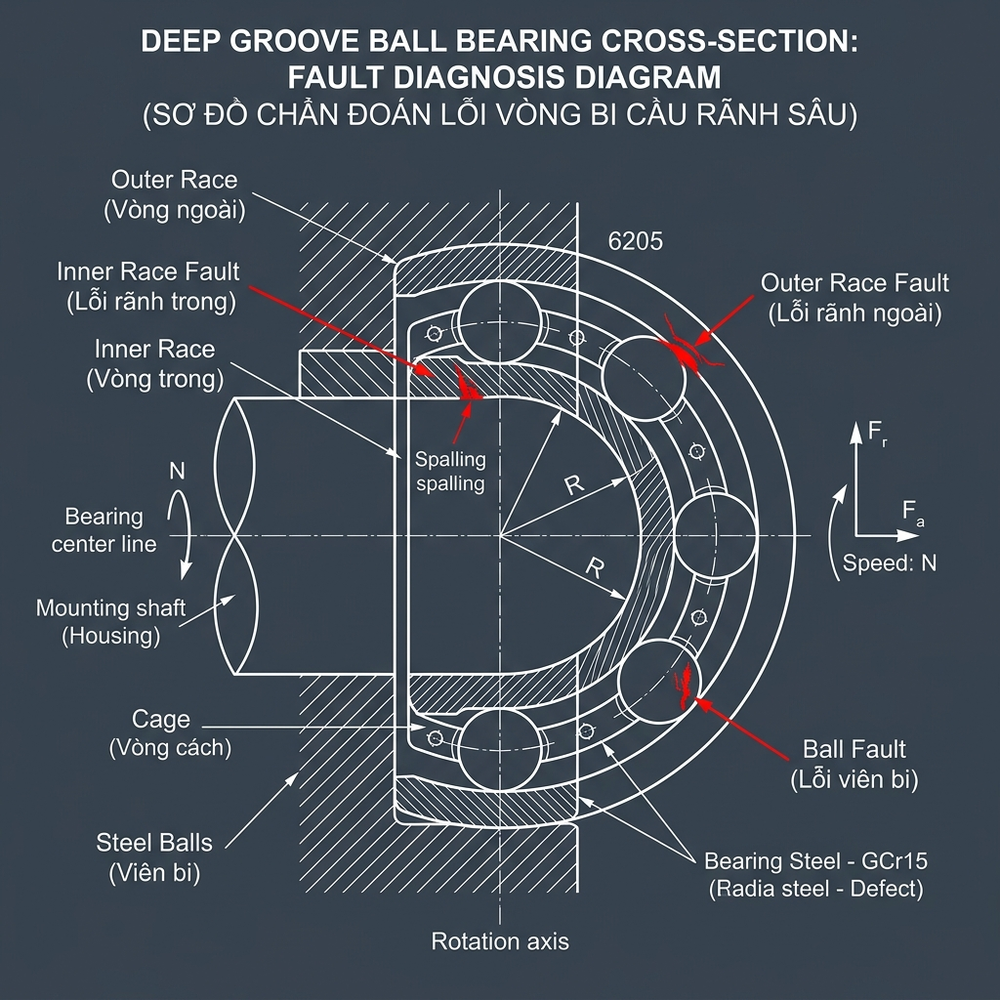
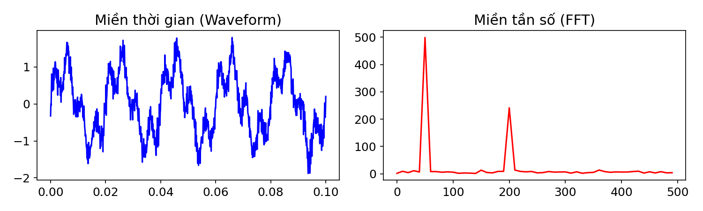
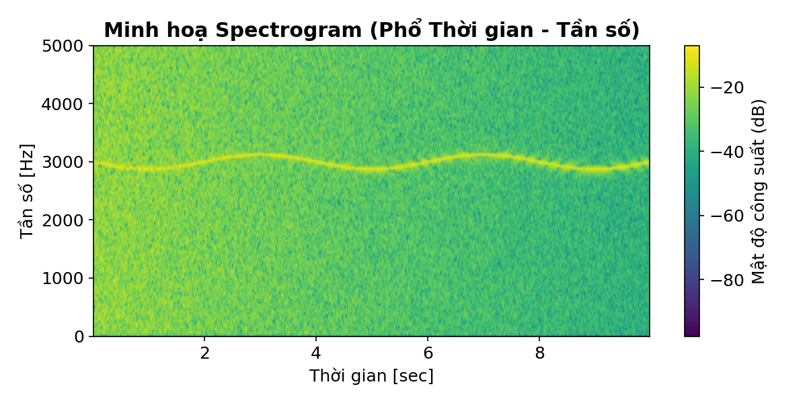
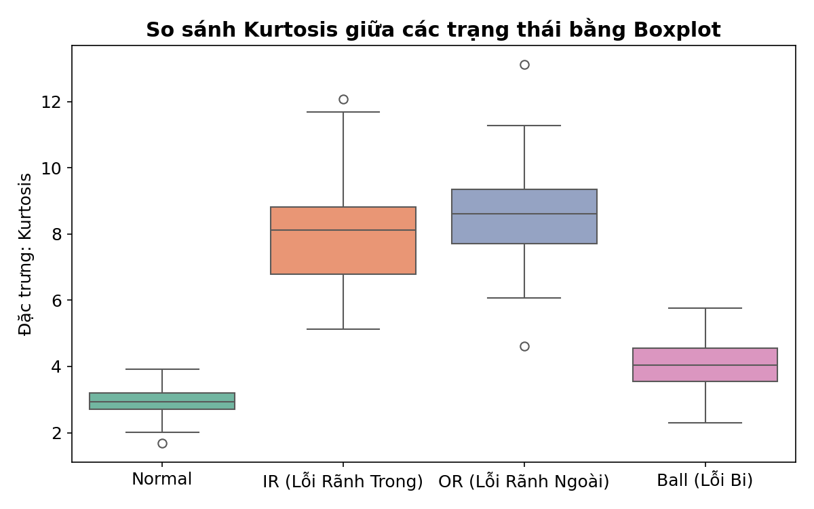

# PHẦN A – MÔ TẢ & PHÂN TÍCH DỮ LIỆU CWRU BEARING DATASET

> **Tài liệu thực hành số 2** – Ứng dụng AI & Giải thích mô hình (XAI)  
> Dành cho kỹ sư bảo trì & vận hành nhà máy

---

## 1. Giới thiệu bộ dữ liệu CWRU (Case Western Reserve University)

### 1.1. Mô hình thí nghiệm

Bộ dữ liệu CWRU là **chuẩn benchmark quốc tế** được sử dụng rộng rãi nhất trong nghiên cứu chẩn đoán hư hỏng ổ lăn. Hệ thống thí nghiệm gồm:

| Thành phần | Mô tả |
|---|---|
| **Động cơ** | Động cơ điện không đồng bộ 2 HP (≈ 1.5 kW), tốc độ quay ~1720–1797 RPM |
| **Ổ lăn thử nghiệm** | Ổ bi cầu SKF 6205-2RS (drive end) và SKF 6203-2RS (fan end) |
| **Bộ tải** | Dynamometer tạo tải từ 0 đến 3 HP |
| **Bộ đo mô-men** | Torque transducer/encoder đo tốc độ quay và mô-men |

**Cách tạo lỗi nhân tạo:**

Các khuyết tật đơn điểm (single-point fault) được tạo bằng phương pháp **gia công phóng điện EDM** (Electro-Discharge Machining) – một kỹ thuật gia công chính xác dùng tia lửa điện để "khoét" vết lõm trên bề mặt ổ lăn. Các kích thước lỗi:

- **7 mils** (0.18 mm) – lỗi nhỏ, giai đoạn đầu
- **14 mils** (0.36 mm) – lỗi trung bình
- **21 mils** (0.53 mm) – lỗi nặng

> 💡 **Ghi nhớ cho kỹ sư:** 1 mil = 0.001 inch = 0.0254 mm. Ổ lăn SKF 6205 có đường kính bi khoảng 8 mm, nên vết lỗi 21 mils (~0.5 mm) đã là khá đáng kể so với kích thước bề mặt tiếp xúc.

### 1.2. Vị trí gắn cảm biến gia tốc

Ba cảm biến gia tốc (accelerometer) được gắn bằng đế nam châm tại:

| Ký hiệu | Vị trí | Vai trò |
|---|---|---|
| **DE** (Drive End) | Đầu truyền động – gần ổ lăn thử nghiệm | Tín hiệu chính, nhạy nhất với lỗi ổ lăn |
| **FE** (Fan End) | Đầu quạt – xa ổ lăn thử nghiệm | Tín hiệu tham chiếu, đo rung lan truyền |
| **BA** (Base) | Đế máy | Đo rung nền, phản ánh trạng thái tổng thể |

> 💡 **Trong thực hành này**, ta sẽ chủ yếu dùng **kênh DE** vì nó gần ổ lăn nhất và cho tín hiệu rõ ràng nhất về hư hỏng.



### 1.3. Tần số lấy mẫu & các mức tải

| Tần số lấy mẫu | Áp dụng cho |
|---|---|
| **12,000 Hz (12 kHz)** | Tất cả các thí nghiệm (drive end + fan end) |
| **48,000 Hz (48 kHz)** | Chỉ thí nghiệm lỗi drive end (độ phân giải cao hơn) |

Mỗi thí nghiệm chạy ở **4 mức tải** khác nhau:

| Mức tải | Tốc độ quay xấp xỉ |
|---|---|
| 0 HP | ~1797 RPM |
| 1 HP | ~1772 RPM |
| 2 HP | ~1750 RPM |
| 3 HP | ~1730 RPM |

> 💡 **Ý nghĩa thực tế:** Khi tải tăng, tốc độ quay giảm (đặc tính động cơ không đồng bộ), và biên độ rung cũng thay đổi. Mô hình ML tốt cần phân loại đúng **bất kể mức tải**.

---

## 2. Dạng dữ liệu & các lớp hư hỏng

### 2.1. Định dạng file

- File `.mat` (MATLAB format), đọc bằng Python qua `scipy.io.loadmat()`
- Mỗi file chứa các biến (variable) theo quy ước:

| Biến | Ý nghĩa |
|---|---|
| `X???_DE_time` | Tín hiệu gia tốc rung tại Drive End theo thời gian |
| `X???_FE_time` | Tín hiệu gia tốc rung tại Fan End theo thời gian |
| `X???_BA_time` | Tín hiệu gia tốc rung tại Base theo thời gian |
| `X???_RPM` | Tốc độ quay (vòng/phút) |

Trong đó `???` là mã số file (ví dụ: `X097_DE_time`).

### 2.2. Các lớp hư hỏng (Fault Classes)

| Ký hiệu | Loại lỗi | Mô tả vật lý |
|---|---|---|
| **Normal** | Bình thường | Ổ lăn không có khuyết tật |
| **IR** | Inner Race Fault – Lỗi rãnh trong | Khuyết tật trên vòng trong (quay cùng trục) |
| **OR** | Outer Race Fault – Lỗi rãnh ngoài | Khuyết tật trên vòng ngoài (cố định trên vỏ) |
| **B** | Ball Fault – Lỗi bi | Khuyết tật trên bề mặt viên bi |



Với lỗi rãnh ngoài (OR), có thêm thông tin **vị trí lỗi** (3 giờ, 6 giờ, 12 giờ) ảnh hưởng đến mức độ va chạm vì vùng chịu tải (load zone) khác nhau.

### 2.3. Kích thước dữ liệu

Mỗi file `.mat` chứa **khoảng 120.000 – 480.000 mẫu** tín hiệu tùy thời gian thu thập. Ở tần số 12 kHz, 120.000 mẫu tương đương **10 giây** đo liên tục. Trong thư mục dữ liệu thực hành, mỗi mức tải (0HP, 1HP, 2HP, 3HP) có khoảng 13–14 file `.mat`.

---

## 3. Biến tín hiệu rung thành bài toán phân loại cho ML

### 3.1. Bước 1: Cắt cửa sổ tín hiệu (Windowing / Segmentation)

Tín hiệu rung là chuỗi thời gian **rất dài** (hàng trăm nghìn điểm). Để đưa vào mô hình ML, ta **cắt** thành nhiều đoạn ngắn (segment) có độ dài cố định:

```
Tín hiệu gốc: ──────────────────────────────────── (120,000 mẫu)
                 │ seg 1 │ seg 2 │ seg 3 │ ...
                 [  2048 ][  2048 ][  2048 ]
```

- **Window size** (độ dài cửa sổ): thường chọn 2048 hoặc 4096 mẫu
  - 2048 mẫu ở 12 kHz ≈ 0.17 giây → vừa đủ chứa vài chu kỳ quay
- **Overlap** (độ chồng lấp): thường 50% để tăng số mẫu huấn luyện

> 💡 **Tại sao chọn 2048?** Ở tốc độ ~1750 RPM, một vòng quay mất ~0.034s (≈ 410 mẫu ở 12 kHz). Cửa sổ 2048 mẫu chứa khoảng 5 vòng quay – đủ để "nhìn thấy" các mẫu lặp lại đặc trưng của từng loại lỗi.

### 3.2. Bước 2: Trích đặc trưng (Feature Extraction)

Từ mỗi segment, ta tính ra **một vector số** (feature vector) gồm các đặc trưng thống kê:

**Đặc trưng miền thời gian (Time-domain):**

| Đặc trưng | Công thức trực giác | Ý nghĩa kỹ thuật |
|---|---|---|
| **Mean** | Giá trị trung bình | Thành phần DC – thường ≈ 0 sau chuẩn hóa |
| **Std** (Độ lệch chuẩn) | Mức dao động quanh trung bình | Càng lớn → rung càng mạnh |
| **RMS** | Căn bậc hai trung bình bình phương | "Năng lượng" rung – chỉ số tổng quát nhất |
| **Peak** | Giá trị đỉnh lớn nhất | Phát hiện xung va chạm mạnh |
| **Crest Factor** | Peak / RMS | Tỷ lệ đỉnh/năng lượng – cao khi có xung nhọn |
| **Skewness** | Độ lệch phân bố | Phân bố rung bất đối xứng → dấu hiệu bất thường |
| **Kurtosis** | Độ nhọn phân bố (Pearson: normal ≈ 3) | Rất nhạy với xung va chạm – **chỉ số vàng** cho ổ lăn |

**Đặc trưng miền tần số (Frequency-domain):**

| Đặc trưng | Cách tính | Ý nghĩa kỹ thuật |
|---|---|---|
| **FFT Energy** | Tổng bình phương biên độ phổ | Năng lượng tổng trong miền tần số |
| **Spectral Mean** | Trung bình biên độ phổ | Mức năng lượng phổ trung bình |
| **Spectral Std** | Độ lệch chuẩn biên độ phổ | Mức phân tán năng lượng theo tần số |
| **Band Energy** | Năng lượng trong dải tần cụ thể | Phát hiện năng lượng tập trung ở tần số đặc trưng lỗi |

### 3.3. Bước 3: Gán nhãn & tạo bảng dữ liệu

Sau khi trích đặc trưng, ta có:

```
X_features = DataFrame (N mẫu × M đặc trưng)
y_labels   = Series    (N nhãn: Normal / IR / OR / B)
```

Đây chính là **dữ liệu dạng bảng** (tabular data) quen thuộc – hoàn toàn phù hợp cho SVM, Random Forest!

### 3.4. Pipeline tổng quan

```
Tín hiệu rung (.mat)
    ↓ Đọc kênh DE
    ↓ Cắt segment (2048 mẫu, overlap 50%)
    ↓ Trích đặc trưng (RMS, kurtosis, FFT energy, ...)
    ↓ Gán nhãn (Normal / IR / OR / B)
    ↓ Chia train / test
    ↓ Huấn luyện SVM / Random Forest
    ↓ Đánh giá (accuracy, confusion matrix)
    ↓ Giải thích bằng SHAP → Kỹ sư hiểu "vì sao"
    ↓ Ra quyết định bảo trì
```

---

## 4. Mục tiêu thực hành

Sau buổi thực hành, học viên sẽ:

1. **Hiểu pipeline hoàn chỉnh** từ tín hiệu rung thô đến quyết định chẩn đoán
2. **Tự xây dựng được** mô hình SVM và Random Forest cho bài toán phân loại lỗi ổ lăn
3. **Đánh giá và so sánh** hai mô hình bằng các chỉ số (accuracy, precision, recall, F1)
4. **Sử dụng SHAP** để giải thích "vì sao mô hình chẩn đoán như vậy" – chuyển từ "hộp đen" sang minh bạch
5. **Liên hệ thực tế:** biết cách áp dụng pipeline cho dữ liệu rung của nhà máy

---

## 5. Phân tích & trực quan hóa dữ liệu

### 5.1. Dạng sóng (Waveform) theo trạng thái



**Cách đọc waveform cho kỹ sư:**

#### Trạng thái bình thường (Normal)
- Dạng sóng tương đối **đều đặn**, biên độ nhỏ, không có xung đột ngột
- Tín hiệu rung chủ yếu là rung nền (background noise) + thành phần quay đều
- Biên độ peak thường < 0.5g (đơn vị gia tốc)

#### Lỗi rãnh trong (Inner Race Fault)
- Xuất hiện **chuỗi xung va chạm lặp lại** với tần số = BPFI (Ball Pass Frequency Inner)
- Xung có **biên độ thay đổi** (modulated) vì vết lỗi trên vòng trong quay vào/ra khỏi vùng chịu tải
  - Sidebands xuất hiện tại **BPFI ± n×fr** (với fr = tần số quay trục ≈ 29.95 Hz @ 1797 RPM)
- Biên độ tăng đáng kể so với bình thường, đặc biệt ở lỗi 14–21 mils

> 💡 **Ngôn ngữ kỹ sư:** "Mỗi khi viên bi lăn qua vết lõm trên rãnh trong, nó tạo ra một cú va đập. Vì rãnh trong quay cùng trục, nên khi vết lỗi ở vùng chịu tải thì va đập mạnh, khi ra ngoài vùng chịu tải thì va đập yếu hơn – tạo ra hiệu ứng 'điều biên' (amplitude modulation) rất đặc trưng, với sidebands ở BPFI ± quay trục."

#### Lỗi rãnh ngoài (Outer Race Fault)
- Cũng có **xung lặp lại** với tần số = BPFO (Ball Pass Frequency Outer)
- Xung thường có **biên độ ổn định hơn** (ít bị điều biên) vì vòng ngoài cố định – vết lỗi luôn ở cùng vị trí so với vùng chịu tải (khi lỗi ở vị trí 6 giờ)
  - **Lưu ý:** CWRU dataset có OR fault ở 3 vị trí (3h, 6h, 12h). Khi vết lỗi ở 6h (trong vùng tải), xung ổn định. Khi ở 12h (ngoài vùng tải), xung lại bị điều biên.
- Biên độ xung rõ ràng, dễ nhận biết nhất khi lỗi ở vùng chịu tải

> 💡 **Ngôn ngữ kỹ sư:** "Vòng ngoài cố định nên vết lỗi không di chuyển. Khi vết lỗi ở vùng chịu tải (6h), mỗi viên bi lăn qua đều va đập với cùng cường độ → tín hiệu xung đều đặn, rất 'sạch'. Đây là loại lỗi dễ chẩn đoán nhất bằng phân tích rung (nếu lỗi ở vị trí thuận lợi)."

#### Lỗi bi (Ball Fault)
- Tín hiệu phức tạp hơn: xung lặp theo tần số BSF (Ball Spin Frequency)
- Viên bi vừa quay vừa tịnh tiến → tín hiệu bị **điều biên mạnh** theo tần số lồng bi (FTF)
- Biên độ xung thường nhỏ hơn lỗi rãnh trong/ngoài → **khó phát hiện hơn**

> 💡 **Ngôn ngữ kỹ sư:** "Viên bi hỏng vừa lăn trên rãnh trong, vừa lăn trên rãnh ngoài, nên tạo ra hai loại va chạm. Hơn nữa, bi còn tự quay quanh trục mình, làm cho vết lỗi lúc tiếp xúc rãnh trong, lúc tiếp xúc rãnh ngoài – tín hiệu trở nên phức tạp và khó đọc hơn."

### 5.2. Phổ tần số (FFT Spectrum)

**Cách đọc phổ FFT cho kỹ sư:**

- **Trục X**: Tần số (Hz) – cho biết "rung ở tần số nào"
- **Trục Y**: Biên độ – cho biết "rung mạnh cỡ nào ở tần số đó"

| Trạng thái | Đặc điểm phổ |
|---|---|
| **Normal** | Chỉ có đỉnh ở tần số quay (1×, 2×, 3× RPM), biên độ thấp |
| **IR fault** | Xuất hiện đỉnh ở BPFI và các bội số (2×, 3× BPFI), có sideband quanh đỉnh (do điều biên) |
| **OR fault** | Đỉnh rõ ở BPFO và bội số, thường sạch hơn (ít sideband) |
| **Ball fault** | Đỉnh ở BSF và bội số, nhưng biên độ thấp hơn, khó phân biệt với nhiễu nền |

> 💡 **Mẹo thực tế:** Với ổ SKF 6205, ở tốc độ ~1797 RPM (không tải): BPFI ≈ 162 Hz, BPFO ≈ 107 Hz, BSF ≈ 141 Hz (= 2×BSF cơ bản). Khi phân tích phổ, hãy nhìn vào các dải tần này trước.

### 5.3. Spectrogram (Phổ thời gian–tần số)



Spectrogram hiển thị **sự thay đổi năng lượng theo cả thời gian và tần số** trên cùng một biểu đồ:
- **Trục X**: Thời gian
- **Trục Y**: Tần số
- **Màu sắc**: Biên độ năng lượng (vàng/đỏ = năng lượng cao, xanh/tím = năng lượng thấp)

| Trạng thái | Đặc điểm spectrogram |
|---|---|
| **Normal** | Màu đồng đều, ít có vệt sáng, năng lượng thấp ở mọi tần số |
| **IR fault** | Các "sọc dọc" (vertical stripes) lặp lại theo chu kỳ BPFI – mỗi sọc là một xung va chạm kích thích năng lượng trên dải tần rộng |
| **OR fault** | Sọc dọc đều đặn hơn, khoảng cách ổn định |
| **Ball fault** | Sọc dọc mờ hơn, đôi khi chỉ thấy rõ ở dải tần cao |

> 💡 **Ngôn ngữ kỹ sư:** "Spectrogram giống như bản đồ nhiệt của rung động. Nếu thấy các vệt sáng lặp lại đều đặn → có xung va chạm tuần hoàn → dấu hiệu ổ lăn hư hỏng. Khoảng cách giữa các vệt cho biết tần số va chạm, từ đó suy ra vị trí lỗi."

### 5.4. Histogram & Boxplot các đặc trưng thống kê



#### RMS (Root Mean Square – Giá trị hiệu dụng)

- **Ý nghĩa:** Đại diện cho "năng lượng rung" tổng thể
- **Kỳ vọng:**
  - Normal: RMS thấp, phân bố tập trung
  - IR / OR: RMS tăng đáng kể, đặc biệt ở mức lỗi lớn (14, 21 mils)
  - Ball: RMS tăng vừa phải

> 💡 **Nhận xét cho kỹ sư:** "Nếu hệ thống giám sát online thấy RMS tăng đột ngột 2–3 lần so với baseline → cần kiểm tra ổ lăn ngay. Nhưng chỉ RMS thôi chưa đủ để biết hỏng ở đâu – cần thêm các đặc trưng khác."

#### Peak (Giá trị đỉnh)

- **Ý nghĩa:** Biên độ va chạm lớn nhất trong segment
- **Kỳ vọng:**
  - Normal: Peak thấp, dao động nhỏ
  - IR / OR: Peak rất cao do xung va chạm mạnh
  - Ball: Peak tăng nhưng không nhiều bằng IR/OR

#### Kurtosis (Độ nhọn)

- **Ý nghĩa:** Phát hiện xung va chạm trong tín hiệu. Tín hiệu bình thường (dạng Gaussian) có kurtosis Pearson ≈ 3. Khi có xung nhọn → kurtosis tăng vọt
  - **Lưu ý:** `scipy.stats.kurtosis()` trả về *excess kurtosis* (fisher=True mặc định), không phải Pearson kurtosis. Excess kurtosis Gaussian ≈ 0, do đó Pearson = excess + 3.
  - Để dùng định nghĩa Pearson (normal=3), dùng `scipy.stats.kurtosis(x, fisher=False)`
- **Kỳ vọng:**
  - Normal: Kurtosis Pearson ≈ 3 (phân bố chuẩn)
  - IR / OR / Ball: Kurtosis Pearson >> 3 (thường >6–10), đặc biệt ở giai đoạn đầu hỏng (xung rõ, chưa bị lan rộng)

> 💡 **Ngôn ngữ kỹ sư:** "Kurtosis là 'công cụ phát hiện sớm' tuyệt vời. Ở giai đoạn rất sớm khi ổ lăn mới bắt đầu có vết nứt nhỏ, RMS có thể chưa tăng đáng kể, nhưng kurtosis đã tăng rõ rệt vì mỗi viên bi lăn qua vết nứt tạo ra xung nhọn – dù nhỏ nhưng đủ để kurtosis 'nhìn thấy'."

#### So sánh trực quan qua boxplot

Khi vẽ boxplot các đặc trưng theo từng lớp lỗi, ta thường thấy:

- **Normal** có hộp (box) nhỏ, gọn, nằm ở vùng giá trị thấp
- **IR** và **OR** có hộp dịch lên cao và/hoặc rộng hơn
- **Ball** nằm ở giữa – khó phân biệt nhất với Normal, đặc biệt ở mức lỗi 7 mils

> 💡 **Bài học thực tiễn:** "Nhìn vào boxplot, nếu các hộp tách biệt rõ ràng → mô hình ML sẽ phân loại dễ dàng. Nếu các hộp chồng lấp nhiều (như Normal vs Ball_007) → mô hình sẽ hay nhầm ở cặp lớp này. Đây cũng là lý do vì sao thực tế, phát hiện lỗi bi giai đoạn sớm vẫn là thách thức lớn."

### 5.5. Tóm tắt: Đặc trưng nào phân biệt lỗi nào?

| Đặc trưng | Normal → IR | Normal → OR | Normal → Ball |
|---|---|---|---|
| **RMS** | Tăng mạnh | Tăng mạnh | Tăng vừa |
| **Peak** | Tăng rất mạnh | Tăng rất mạnh | Tăng vừa |
| **Kurtosis** | Tăng mạnh | Tăng mạnh | Tăng nhẹ → vừa |
| **Crest Factor** | Tăng | Tăng | Tăng nhẹ |
| **FFT Energy** | Tăng, tập trung quanh BPFI | Tăng, tập trung quanh BPFO | Phân tán hơn |
| **Spectral Kurtosis** | Tăng ở dải tần cộng hưởng | Tăng ở dải tần cộng hưởng | Tăng ít |

> 💡 **Kết luận cho kỹ sư:** "Không có một đặc trưng duy nhất nào hoàn hảo. Sức mạnh của ML nằm ở chỗ **kết hợp nhiều đặc trưng** cùng lúc để đưa ra chẩn đoán chính xác. SVM và Random Forest sẽ tự tìm ra 'công thức phối hợp' tối ưu giữa các đặc trưng – và SHAP sẽ cho ta biết 'công thức' đó là gì."

---

## 6. Công thức tính tần số lỗi cho ổ lăn bất kỳ

Các giá trị BPFO, BPFI, FTF, BSF ở trên dùng cho SKF 6205 @ 1797 RPM. Nếu bạn muốn tính cho ổ lăn khác hoặc tốc độ quay khác, dùng công thức chuẩn ISO:

**Ký hiệu:**
- `fr` = tần số quay trục (shaft frequency) = RPM / 60 [Hz]
- `nb` = số viên bi trong ổ lăn [số]
- `bd` = đường kính viên bi [mm]
- `pd` = đường kính lồng bi (pitch diameter) [mm]
- `φ` = góc tiếp xúc (contact angle) [độ]

**Công thức:**

```
BPFO = (nb/2) × fr × [1 - (bd/pd) × cos(φ)]  ← Outer race
BPFI = (nb/2) × fr × [1 + (bd/pd) × cos(φ)]  ← Inner race
FTF = fr × [1 - (bd/pd) × cos(φ)] / 2         ← Cage frequency
BSF = (pd/2bd) × fr × [1 - (bd/pd)²]          ← Ball spin frequency
```

**Ví dụ SKF 6205:** `nb=9, bd=7.94mm, pd=38.5mm, φ=0°, fr=29.95 Hz` → BPFO≈107 Hz, BPFI≈162 Hz, FTF≈11.9 Hz, BSF≈70.6 Hz (⚠️ CWRU dùng 2×BSF=141 Hz).

---

*Tài liệu này được biên soạn dựa trên dữ liệu từ Case Western Reserve University Bearing Data Center (https://engineering.case.edu/bearingdatacenter) phục vụ mục đích đào tạo.*
