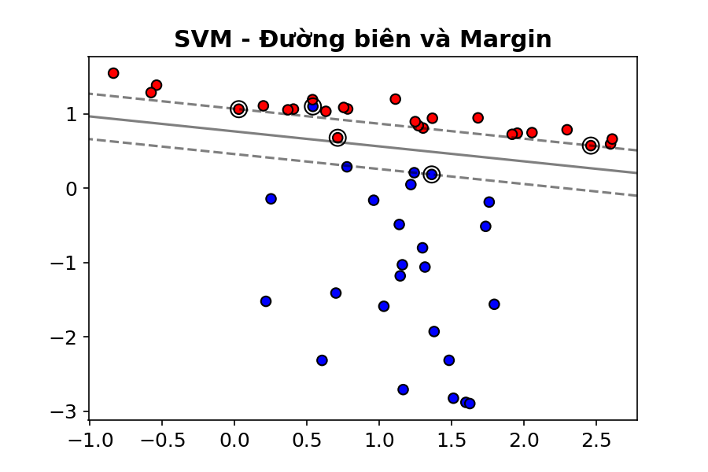
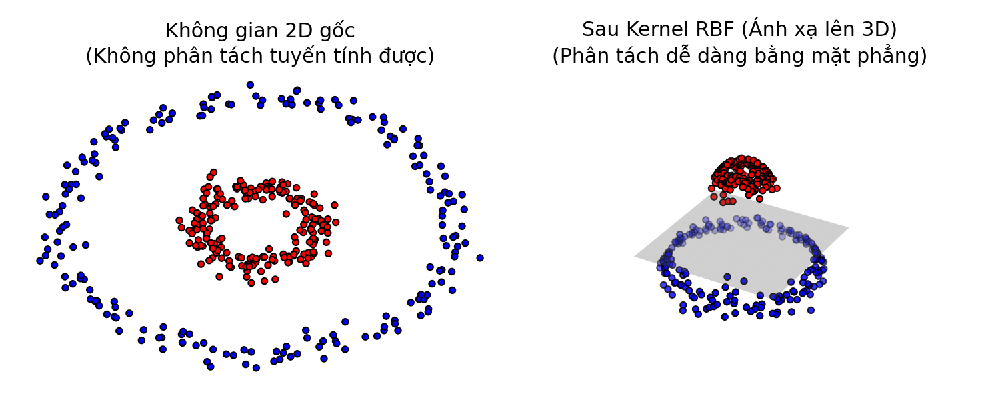
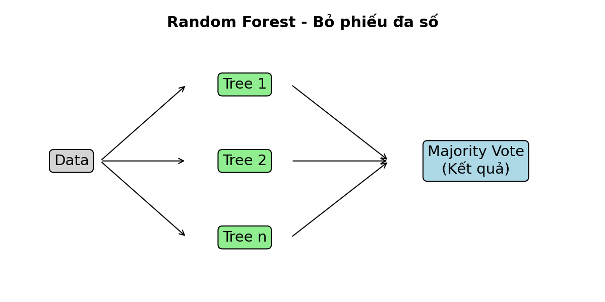

# PHẦN B – GIẢI THÍCH SVM & RANDOM FOREST CHO KỸ SƯ

> **Tài liệu thực hành số 2** – Ứng dụng AI & Giải thích mô hình (XAI)  
> Dành cho kỹ sư bảo trì & vận hành nhà máy

---

## 1. Support Vector Machine (SVM) – "Tìm đường biên an toàn nhất"

### 1.1. Ý tưởng cốt lõi

Hãy tưởng tượng bạn là quản đốc và cần **phân chia kho hàng** thành 2 khu vực: hàng đạt chất lượng (✓) và hàng lỗi (✗). Bạn kéo một sợi dây phân cách giữa hai nhóm hàng.

- **SVM tìm sợi dây sao cho khoảng cách từ dây đến hàng gần nhất ở mỗi bên là lớn nhất** – gọi là **maximum margin** (khoảng cách an toàn lớn nhất).
- Những mẫu hàng nằm sát đường biên nhất gọi là **support vectors** (các "điểm tựa" quyết định vị trí đường biên).



> 💡 **Analog thực tế:** Giống như khi bạn phân luồng giao thông – dải phân cách càng rộng, xác suất va chạm càng thấp. SVM tìm dải phân cách rộng nhất giữa các loại lỗi.

### 1.2. SVM tuyến tính vs SVM với Kernel (RBF)

**SVM tuyến tính:**
- Đường biên là một **đường thẳng** (2D) hoặc **mặt phẳng** (nhiều chiều)
- Hoạt động tốt khi dữ liệu **tách biệt rõ ràng** bằng đường thẳng

**Vấn đề:** Trong thực tế, dữ liệu lỗi ổ lăn thường **trộn lẫn** nhau, không tách được bằng đường thẳng. Ví dụ: lỗi bi nhẹ (Ball_007) có RMS và kurtosis gần giống bình thường.

**SVM với kernel RBF (Radial Basis Function):**
- Kernel RBF "**ánh xạ dữ liệu lên không gian cao hơn**" – nơi mà dữ liệu trở nên tách biệt dễ hơn
- Hãy tưởng tượng: bạn có hai nhóm bi (đỏ và xanh) nằm lẫn lộn trên mặt bàn (2D) – không kẻ được đường thẳng phân tách. Nhưng nếu bạn **nâng nhóm đỏ lên cao** (3D), bạn có thể dùng một mặt phẳng ngang để tách → đó chính là ý tưởng kernel.



> 💡 **Ghi nhớ:** Kernel RBF là lựa chọn mặc định tốt cho hầu hết bài toán chẩn đoán rung. Bạn không cần hiểu toán phía sau – chỉ cần biết nó giúp SVM xử lý được dữ liệu phức tạp.

### 1.3. Các siêu tham số quan trọng

| Siêu tham số | Ý nghĩa thực tế | Giá trị nhỏ | Giá trị lớn |
|---|---|---|---|
| **C** (Regularization) | Mức độ "nghiêm khắc" của mô hình | Chấp nhận sai một số mẫu để có margin rộng → **tổng quát hơn** nhưng có thể bỏ sót lỗi | Bắt buộc phân loại đúng hầu hết mẫu train → **chính xác trên train** nhưng dễ overfitting |
| **gamma** (RBF kernel) | "Bán kính ảnh hưởng" của mỗi mẫu | Mỗi mẫu ảnh hưởng xa → đường biên **mượt** | Mỗi mẫu chỉ ảnh hưởng gần → đường biên **uốn lượn**, dễ overfitting |

> 💡 **Analog kỹ sư:**
> - **C nhỏ** giống như đặt ngưỡng cảnh báo rung cao → ít báo động giả nhưng có thể bỏ sót lỗi thật
> - **C lớn** giống như đặt ngưỡng thấp → phát hiện mọi bất thường nhưng nhiều báo động giả
> - **gamma** giống như chọn kích thước vùng "lân cận" khi so sánh: gamma nhỏ = nhìn tổng thể, gamma lớn = nhìn chi tiết từng điểm

### 1.4. SVM cho bài toán CWRU

- **Ưu điểm:** Hiệu quả cao khi số đặc trưng vừa phải (10–20 features), các lớp lỗi phân tách tương đối rõ
- **Hạn chế:** Chậm khi dữ liệu lớn (> 10,000 mẫu), khó giải thích "vì sao phân loại vậy"
- **Thực tế:** SVM + RBF kernel thường cho accuracy 95–99% trên CWRU ở cùng mức tải

---

## 2. Random Forest – "Hội đồng nhiều chuyên gia"

### 2.1. Ý tưởng cốt lõi: "Wisdom of the Crowd"

Hãy tưởng tượng bạn cần chẩn đoán một máy bị rung bất thường. Thay vì hỏi **một chuyên gia duy nhất**, bạn mời **100 chuyên gia** (= 100 cây quyết định), mỗi người:

1. Được xem một **mẫu dữ liệu khác nhau** (bootstrap – lấy mẫu ngẫu nhiên có hoàn lại)
2. Chỉ được xem một **số đặc trưng ngẫu nhiên** (random feature selection) ở mỗi bước quyết định
3. Đưa ra **chẩn đoán độc lập**

Cuối cùng, **biểu quyết đa số** → kết quả chung. Đây chính là Random Forest!



> 💡 **Tại sao hiệu quả?** Giống như cuộc thi "Ai là triệu phú" – khi bạn dùng "trợ giúp khán giả", đa số mọi người chọn đúng dù từng cá nhân có thể sai. Mỗi cây quyết định có thể sai ở một số mẫu, nhưng khi kết hợp 100–500 cây, sai số triệt tiêu lẫn nhau.

### 2.2. Cây quyết định – Viên gạch cơ bản

Mỗi cây quyết định giống như **sơ đồ quy trình xử lý sự cố** mà kỹ sư vẫn dùng:

```
RMS > 2.5?
├── Có → Kurtosis > 8?
│         ├── Có → FFT energy ở BPFI cao? 
│         │         ├── Có → Inner Race Fault
│         │         └── Không → Ball Fault
│         └── Không → Outer Race Fault
└── Không → Normal
```

Mỗi nhánh là một **câu hỏi yes/no** dựa trên một đặc trưng cụ thể. Cây quyết định tự học các ngưỡng tối ưu từ dữ liệu.

### 2.3. Bagging & Random Feature Selection

**Bagging (Bootstrap Aggregating):**
- Từ N mẫu dữ liệu gốc, tạo ra nhiều tập con bằng cách **rút ngẫu nhiên có hoàn lại**
- Mỗi tập con có ~63% dữ liệu gốc (một số mẫu bị lặp, một số bị bỏ qua)
- Mỗi cây được huấn luyện trên một tập con khác nhau → **đa dạng hóa**

**Random Feature Selection:**
- Ở mỗi nút (node) của cây, thay vì xét **tất cả** đặc trưng, chỉ xét **một tập con ngẫu nhiên** (thường √M đặc trưng, với M là tổng số đặc trưng)
- Điều này ngăn không cho tất cả cây đều "nhìn" vào cùng đặc trưng mạnh nhất → tăng tính đa dạng

> 💡 **Analog:** Trong nhà máy, khi điều tra sự cố, nếu mọi người đều chỉ nhìn vào một chỉ số (ví dụ nhiệt độ), có thể bỏ sót nguyên nhân gốc. Random Forest buộc mỗi "chuyên gia" phải xét các góc nhìn khác nhau – có người nhìn rung, có người nhìn dòng điện, có người nhìn nhiệt → kết hợp lại cho kết quả toàn diện hơn.

### 2.4. Điểm mạnh của Random Forest

| Ưu điểm | Giải thích |
|---|---|
| **Chống overfitting tốt** | Nhiều cây "trung hòa" sai số của nhau |
| **Xử lý tốt dữ liệu tabular** | Rất phù hợp với đặc trưng dạng số (RMS, kurtosis, ...) |
| **Feature Importance** | Cho biết đặc trưng nào quan trọng nhất → kỹ sư biết cần giám sát chỉ số nào |
| **Ít cần tinh chỉnh** | Hoạt động tốt ngay với tham số mặc định |
| **Nhanh** | Huấn luyện nhanh hơn SVM trên dữ liệu lớn |
| **Kết hợp tốt với SHAP** | TreeExplainer tính SHAP rất nhanh → thuận tiện cho giải thích mô hình |

### 2.5. Các siêu tham số quan trọng

| Siêu tham số | Ý nghĩa | Gợi ý |
|---|---|---|
| **n_estimators** | Số cây trong rừng | 100–500 cây, nhiều hơn thường tốt hơn nhưng chậm hơn |
| **max_depth** | Chiều sâu tối đa mỗi cây | None (không giới hạn) hoặc 10–20. Giới hạn để tránh overfitting |
| **max_features** | Số đặc trưng xét ở mỗi node | 'sqrt' (căn bậc hai) là mặc định tốt |
| **min_samples_leaf** | Số mẫu tối thiểu ở lá | 1–5, tăng lên nếu nghi overfitting |

### 2.6. Random Forest cho bài toán CWRU

- **Ưu điểm:** Robust khi có nhiều đặc trưng (time + frequency), xử lý tốt tương tác giữa các feature, cho feature importance, kết hợp SHAP dễ dàng
- **Thực tế:** Thường cho accuracy 96–99% trên CWRU, tương đương hoặc tốt hơn SVM
- **Feature importance** giúp kỹ sư thấy ngay: "À, kurtosis và RMS là hai chỉ số quan trọng nhất cho chẩn đoán ổ lăn"

---

## 3. So sánh SVM vs Random Forest trong chẩn đoán ổ lăn

| Tiêu chí | SVM (RBF kernel) | Random Forest |
|---|---|---|
| **Độ chính xác** | Rất cao (95–99%) | Rất cao (96–99%) |
| **Tốc độ huấn luyện** | Chậm khi dữ liệu > 10K mẫu | Nhanh, scale tốt |
| **Tốc độ dự đoán** | Nhanh | Nhanh |
| **Khả năng giải thích** | Khó (cần KernelExplainer chậm) | Dễ (TreeExplainer rất nhanh) |
| **Feature importance** | Không trực tiếp | Có sẵn |
| **Tinh chỉnh tham số** | Cần tune C, gamma cẩn thận | Ít nhạy với tham số |
| **Dữ liệu nhiễu** | Nhạy hơn (cần tune C) | Robust hơn |
| **Phù hợp với** | Feature ít, tách biệt tốt | Feature nhiều, có tương tác |

> 💡 **Khuyến nghị cho kỹ sư:** Trong thực tế nhà máy, **Random Forest thường là lựa chọn đầu tiên** vì: (1) dễ triển khai, (2) ít cần tinh chỉnh, (3) cho feature importance giúp kỹ sư hiểu, (4) kết hợp SHAP dễ dàng. SVM là lựa chọn tốt khi bạn đã chọn lọc được bộ đặc trưng tinh gọn và muốn "vắt" thêm hiệu suất.

---

## 4. Câu hỏi thảo luận cho học viên

1. **"Trong thực tế nhà máy, khi nào nên ưu tiên Random Forest hơn SVM?"**
   - Gợi ý: Khi bạn chưa biết feature nào quan trọng, cần triển khai nhanh, hoặc cần giải thích cho quản lý.

2. **"Nếu tín hiệu rung rất nhiễu (ví dụ: máy đặt gần máy nén khí), mô hình nào 'chịu' được tốt hơn?"**
   - Gợi ý: RF thường robust hơn nhờ bagging (trung bình nhiều cây). SVM có thể cần tăng C hoặc dùng kernel phù hợp.

3. **"Nếu ta chỉ có 50 mẫu đo (5 lần đo × 10 trạng thái), nên dùng mô hình nào?"**
   - Gợi ý: SVM thường hiệu quả hơn trên dữ liệu nhỏ (maximum margin tận dụng tốt ít mẫu). RF cần nhiều dữ liệu hơn để "rừng" đa dạng.

4. **"Feature importance của Random Forest cho thấy 'kurtosis' là đặc trưng quan trọng nhất. Điều đó có nghĩa gì với chiến lược giám sát hiện trường?"**
   - Gợi ý: Có thể ưu tiên giám sát online bằng kurtosis, đặt ngưỡng cảnh báo dựa trên kurtosis trước.

5. **"Nếu mô hình SVM đạt 99% accuracy trên CWRU nhưng chỉ 85% trên dữ liệu nhà máy của bạn, nguyên nhân có thể là gì?"**
   - Gợi ý: Domain shift – điều kiện vận hành khác, loại ổ lăn khác, vị trí cảm biến khác, nhiễu môi trường. Cần thu thập dữ liệu nhà máy và fine-tune hoặc huấn luyện lại.

---

*Tài liệu tham khảo: Breiman (2001) – Random Forests; Cortes & Vapnik (1995) – Support Vector Networks*
