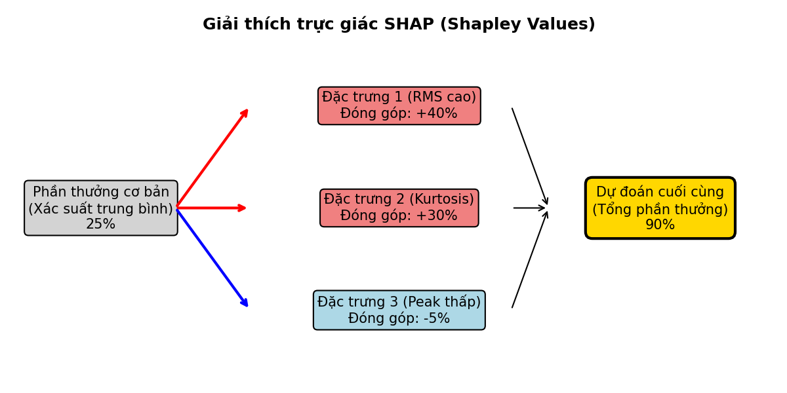
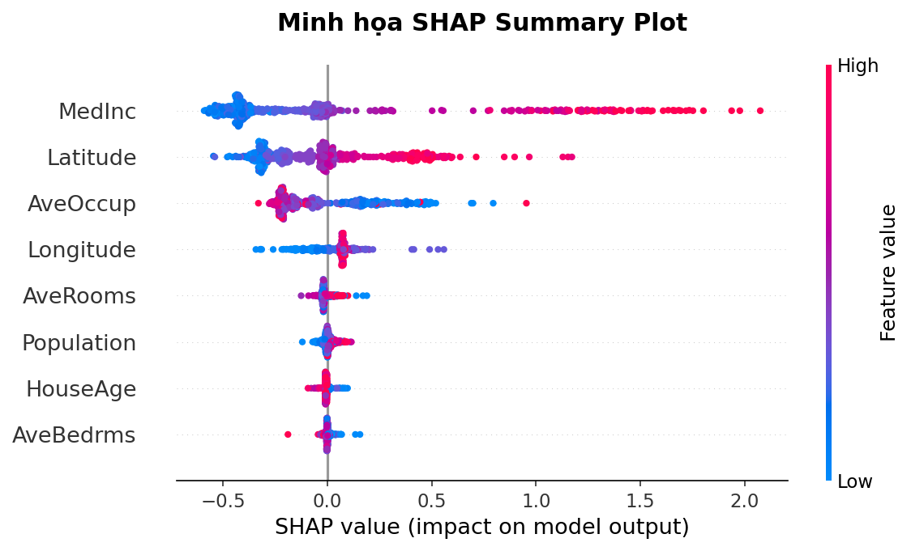
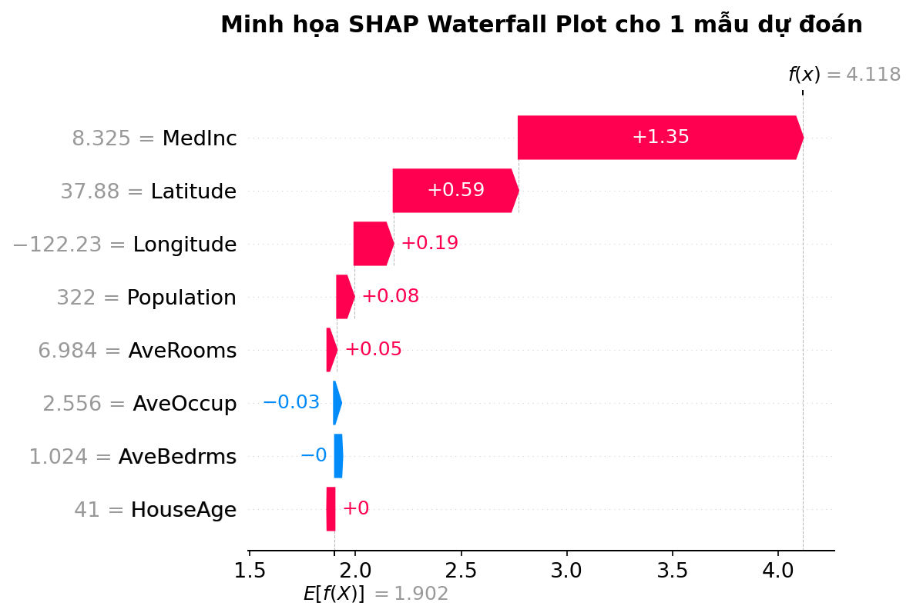

# PHẦN D – TÀI LIỆU GIẢI THÍCH SHAP CHO KỸ SƯ

> **Handout thực hành số 2** – Giải thích mô hình AI bằng SHAP  
> Dành cho kỹ sư bảo trì & vận hành nhà máy

---

## 1. Vì sao cần XAI & SHAP trong chẩn đoán thiết bị?

### 1.1. Vấn đề "hộp đen"

Khi mô hình Machine Learning (SVM, Random Forest, Deep Learning) đưa ra dự đoán "ổ lăn bị hỏng rãnh trong với xác suất 92%", câu hỏi tự nhiên của kỹ sư là:

- **"Tại sao mô hình lại nghĩ vậy?"**
- **"Nó nhìn thấy dấu hiệu gì trên tín hiệu rung?"**
- **"Tôi có thể tin và ra quyết định dừng máy dựa trên kết quả này không?"**

Nếu mô hình chỉ đưa ra con số xác suất mà **không giải thích được lý do**, kỹ sư sẽ:
- Không dám tin để ra quyết định bảo trì quan trọng (dừng máy = thiệt hại sản xuất)
- Không biết kết quả có đúng không, hay mô hình đang "nhầm" vì dữ liệu bất thường
- Không học được kinh nghiệm từ mô hình để cải thiện kỹ năng chẩn đoán

### 1.2. Kỹ sư cần gì từ AI?

| Kỹ sư không cần | Kỹ sư cần |
|---|---|
| "Xác suất lỗi Inner Race: 0.92" | "RMS tăng 3 lần + xuất hiện năng lượng mạnh quanh tần số 162 Hz (BPFI) → dấu hiệu lỗi rãnh trong" |
| "Mô hình SVM kernel RBF, C=10" | "3 đặc trưng quan trọng nhất: kurtosis, RMS, FFT energy dải BPFI" |
| Công thức toán phức tạp | Biểu đồ trực quan cho thấy đặc trưng nào "đẩy" dự đoán về phía lỗi |

**→ SHAP** giúp chuyển từ "hộp đen" sang "hộp kính" – mô hình vẫn phức tạp bên trong, nhưng ta có thể **nhìn thấy** nó đang dựa vào đâu để ra quyết định.

---

## 2. Trực giác về Shapley Value và SHAP

### 2.1. Ví dụ "3 kỹ sư cùng đóng góp cho dự án"

Hãy tưởng tượng 3 kỹ sư (A, B, C) cùng làm một dự án bảo trì và tạo ra lợi nhuận 1 tỷ VNĐ. Hỏi: **mỗi người đóng góp bao nhiêu?**

**Cách tính Shapley (Lloyd Shapley – giải Nobel 2012):**

Xét **mọi trường hợp** khi thêm từng người vào nhóm:

| Thứ tự thêm | Khi thêm A | Khi thêm B | Khi thêm C |
|---|---|---|---|
| A → B → C | A một mình: 200tr → **đóng góp A = 200tr** | A+B: 600tr → **đóng góp B = 400tr** | A+B+C: 1000tr → **đóng góp C = 400tr** |
| A → C → B | A: 200tr → **200tr** | A+C+B: 1000tr → **đóng góp B = 300tr** | A+C: 700tr → **đóng góp C = 500tr** |
| B → A → C | B: 300tr → **đóng góp B = 300tr** | B+A: 600tr → **đóng góp A = 300tr** | B+A+C: 1000tr → **đóng góp C = 400tr** |
| ... | ... | ... | ... |

**Shapley value của mỗi người = Trung bình đóng góp biên qua TẤT CẢ thứ tự có thể.**



Kết quả: mỗi người nhận được phần **công bằng**, phản ánh đúng đóng góp thực sự khi kết hợp với những người khác.

### 2.2. Ánh xạ sang Machine Learning

| Trong ví dụ kỹ sư | Trong Machine Learning |
|---|---|
| Kỹ sư A, B, C | Đặc trưng (feature): RMS, kurtosis, FFT energy, ... |
| Lợi nhuận dự án (1 tỷ) | Dự đoán của mô hình (ví dụ: xác suất lỗi = 0.92) |
| Đóng góp của kỹ sư A | SHAP value của RMS cho mẫu này |
| "A giỏi nhất, đóng góp nhiều nhất" | "RMS có SHAP value lớn nhất → ảnh hưởng nhiều nhất đến dự đoán" |

**Công thức tóm tắt (không cần nhớ, chỉ cần hiểu ý):**

```
Dự đoán cho mẫu x = Base value + SHAP(feature₁) + SHAP(feature₂) + ... + SHAP(featureₙ)
```

- **Base value**: Dự đoán "trung bình" khi không biết gì về mẫu (≈ trung bình tất cả mẫu)
- **SHAP(feature)**: Đóng góp của từng đặc trưng → dương = đẩy dự đoán lên, âm = kéo dự đoán xuống

> 💡 **Ví dụ cụ thể:** Dự đoán "xác suất lỗi Inner Race" = 0.25 (base) + 0.35 (RMS cao) + 0.20 (kurtosis cao) + 0.15 (FFT energy BPFI cao) – 0.03 (crest factor thấp) = **0.92**

---

## 3. Kernel SHAP & Tree SHAP – Cách hoạt động ở mức trực giác

### 3.1. Kernel SHAP (dùng cho mọi mô hình, kể cả SVM)

**Ý tưởng:**

1. Lấy mẫu cần giải thích (ví dụ: một segment rung nghi lỗi)
2. Tạo **nhiều phiên bản** của mẫu đó, mỗi phiên bản **"che"** (mask) một số đặc trưng bằng giá trị nền (background value – thường là trung bình từ tập huấn luyện)
3. Chạy mỗi phiên bản qua mô hình → xem **dự đoán thay đổi thế nào** khi có/không có từng feature
4. Giải một **bài toán hồi quy tuyến tính có trọng số** để suy ra đóng góp của từng feature

> 💡 **Analog kỹ sư:** Giống như khi bạn kiểm tra hệ thống: tắt từng thiết bị phụ trợ (bơm, quạt, van) để xem thiết bị nào ảnh hưởng đến rung → thiết bị nào tắt đi mà rung giảm nhiều nhất = đóng góp lớn nhất vào rung.

**Ưu điểm:** Hoạt động với **mọi** mô hình (SVM, Neural Network, ...)  
**Nhược điểm:** **Chậm** vì phải chạy mô hình nhiều lần

### 3.2. Tree SHAP (dùng cho Random Forest, Gradient Boosting)

**Ý tưởng:**
- Khai thác **cấu trúc cây** quyết định để tính SHAP value nhanh hơn nhiều
- Thay vì phải "che" và chạy mô hình hàng nghìn lần, Tree SHAP duyệt qua các nhánh cây và tính trực tiếp đóng góp

**Ưu điểm:** 
- **Rất nhanh** (tính trong mili-giây thay vì phút)
- **Chính xác tuyệt đối** (exact Shapley values, không xấp xỉ)
- **Lý tưởng cho thực hành** vì kết quả ra ngay lập tức

> 💡 **Trong thực hành hôm nay:** Ta sẽ dùng `shap.TreeExplainer` cho Random Forest (nhanh) và nếu có thời gian, thử `shap.KernelExplainer` cho SVM (chậm hơn, cần background sample).

---

## 4. Triển khai SHAP trong notebook thực hành CWRU

### 4.1. Chuẩn bị

```python
import shap

# Chọn 200 mẫu ngẫu nhiên từ tập train làm "nền" (background)
background = shap.sample(X_train, 200)

# Tạo explainer cho Random Forest (nhanh)
explainer_rf = shap.TreeExplainer(rf_model)

# Tạo explainer cho SVM (chậm hơn, cần background)
# ⚠️ BẮT BUỘC: svm_clf phải được khởi tạo với probability=True
#    -> SVC(kernel='rbf', probability=True). Nếu không, .predict_proba()
#    không tồn tại và KernelExplainer sẽ lỗi AttributeError.
# ⚠️ probability=True khiến SVM huấn luyện CHẬM hơn nhiều (~3–5×) vì
#    sklearn phải chạy Platt scaling (CV 5-fold nội bộ) để hiệu chỉnh xác suất.
explainer_svm = shap.KernelExplainer(svm_clf.predict_proba, background)
```

### 4.2. Tính SHAP values

```python
# Tính SHAP cho subset test (ví dụ 200 mẫu)
shap_values_raw = explainer_rf.shap_values(X_test[:200])

# ⚠️ Với bài toán NHIỀU LỚP (Normal/IR/OR/B), shap_values có 2 dạng tùy phiên bản:
#   - SHAP cũ (< 0.42): trả về list, mỗi phần tử là mảng (n_mẫu, n_đặc_trưng) cho 1 lớp
#   - SHAP mới (>= 0.42): trả về mảng 3D (n_mẫu, n_đặc_trưng, n_lớp)
# Code dưới đây xử lý được cả hai → tách thành list theo từng lớp:
if isinstance(shap_values_raw, list):
    shap_values = shap_values_raw                       # đã là list theo lớp
else:
    shap_values = [shap_values_raw[:, :, c]             # cắt mảng 3D theo lớp
                   for c in range(shap_values_raw.shape[2])]
# shap_values[k] = đóng góp của các đặc trưng cho LỚP thứ k
```

### 4.3. Vẽ các biểu đồ SHAP

```python
import numpy as np

class_names = list(le.classes_)          # ['B', 'IR', 'Normal', 'OR']

# --- Summary plot cho MỘT lớp cụ thể (ví dụ lớp 'OR') ---
or_idx = class_names.index('OR')
shap.summary_plot(shap_values[or_idx], X_test[:200],
                   feature_names=list(X_test.columns), show=True)

# --- Waterfall plot: giải thích CHÍNH XÁC 1 mẫu (mẫu thứ 0, lớp 'OR') ---
sample_idx = 0
# expected_value cũng có thể là scalar hoặc mảng theo lớp -> xử lý an toàn:
ev = explainer_rf.expected_value
base_val = ev[or_idx] if hasattr(ev, '__len__') else ev

exp = shap.Explanation(
    values=shap_values[or_idx][sample_idx],          # (n_đặc_trưng,) cho lớp OR
    base_values=base_val,
    data=X_test.iloc[sample_idx].values,             # GIÁ TRỊ VẬT LÝ gốc (chưa scale)
    feature_names=list(X_test.columns)
)
shap.plots.waterfall(exp, max_display=10)            # API mới (shap >= 0.41)
```

> 💡 **Hai lỗi thường gặp khi tự code:**
> 1. **Lập chỉ số sai trên mảng 3D:** viết `shap_values[or_idx]` khi SHAP trả về mảng 3D `(n_mẫu, n_đặc_trưng, n_lớp)` sẽ lấy nhầm *mẫu* thứ `or_idx` chứ không phải *lớp* OR. Luôn tách list theo lớp như mục 4.2 trước.
> 2. **Truyền dữ liệu đã scale vào `data=`:** waterfall sẽ hiển thị z-score (vd `kurtosis = 1.5`) thay vì giá trị vật lý (`kurtosis = 12`) → kỹ sư không đọc được. Random Forest **không cần scale**, nên hãy tính SHAP và hiển thị trên dữ liệu **gốc**.

---

## 5. Cách đọc và diễn giải các biểu đồ SHAP

### 5.1. Summary Plot (Biểu đồ tổng quan)



Đây là biểu đồ **quan trọng nhất** – cho thấy bức tranh toàn cảnh:

- **Trục Y**: Tên các đặc trưng, sắp xếp theo mức độ quan trọng (trên cùng = quan trọng nhất)
- **Trục X**: SHAP value (đóng góp vào dự đoán)
  - Giá trị dương (+) → đẩy dự đoán về phía lớp đang xét
  - Giá trị âm (–) → kéo dự đoán khỏi lớp đang xét
- **Màu sắc**: 
  - 🔴 Đỏ = giá trị feature CAO
  - 🔵 Xanh = giá trị feature THẤP

**Cách đọc ví dụ:** Nếu ở dòng "kurtosis", các điểm đỏ (kurtosis cao) nằm bên phải (SHAP dương) → **kurtosis cao đẩy dự đoán về phía lớp lỗi**. Điều này hợp lý vì ổ lăn hỏng tạo xung → kurtosis tăng.

> 💡 **Mẹo cho kỹ sư:** Nhìn 3–5 feature trên cùng → đó là các chỉ số bạn nên ưu tiên giám sát trên hệ thống online.

### 5.2. Waterfall Plot (Biểu đồ thác nước cho một mẫu)



Biểu đồ này giải thích **một mẫu cụ thể** – ví dụ một segment rung mà mô hình chẩn đoán là "lỗi rãnh trong":

```
Base value (0.25)   ── trung bình chung
  + RMS = 3.2       ── +0.35 (RMS cao → tăng xác suất lỗi)
  + Kurtosis = 12    ── +0.20 (kurtosis cao → có xung va chạm)
  + FFT_energy = 0.8 ── +0.15 (năng lượng tần số cao)
  – Crest_factor = 2 ── –0.03 (crest factor thấp, hơi mâu thuẫn)
  ═══════════════════
  = Dự đoán: 0.92 (Inner Race Fault)
```

**Cách biến waterfall thành "câu chuyện chẩn đoán":**

> "Mô hình dự đoán mẫu này là lỗi rãnh trong (IR) với xác suất 92%. Lý do chính: 
> - RMS tăng 3 lần so với mức bình thường → rung tổng thể mạnh
> - Kurtosis = 12 (bình thường ≈ 3) → có xung va chạm rõ ràng trong tín hiệu
> - Năng lượng phổ tập trung quanh dải tần BPFI → đúng đặc điểm lỗi rãnh trong
> 
> Crest factor hơi thấp có thể do lỗi đã phát triển (từ xung nhọn ban đầu sang rung lan tỏa), nhưng các dấu hiệu khác đủ mạnh để khẳng định chẩn đoán."

### 5.3. Bar Plot (Biểu đồ thanh – Feature Importance tổng thể)

- Hiển thị **trung bình |SHAP value|** cho mỗi feature
- Giống feature importance của Random Forest nhưng **chính xác hơn** (dựa trên lý thuyết Shapley)
- Dùng để trả lời: "Nhìn chung, feature nào quan trọng nhất?"

### 5.4. Force Plot (Biểu đồ lực)

- Phiên bản ngang của waterfall plot
- Các mũi tên đỏ (đẩy dự đoán lên) và xanh (kéo xuống) cho thấy "cuộc chiến" giữa các feature
- Trực quan nhưng khó đọc khi nhiều feature → waterfall plot thường rõ ràng hơn

---

## 6. Kết nối SHAP với quyết định bảo trì

### 6.1. Từ SHAP đến hành động

| SHAP cho thấy | Quyết định bảo trì |
|---|---|
| RMS, kurtosis tăng nhẹ, SHAP values nhỏ → xác suất lỗi ~60% | **Theo dõi:** Tăng tần suất đo rung từ 1 lần/tháng → 1 lần/tuần |
| RMS, kurtosis tăng rõ, SHAP values trung bình → xác suất lỗi ~80% | **Lên kế hoạch:** Đặt hàng ổ lăn thay thế, lên lịch bảo trì trong 2–4 tuần tới |
| RMS, kurtosis rất cao, FFT energy tập trung ở tần số lỗi → xác suất >95% | **Hành động:** Thay ổ lăn trong lần dừng máy sớm nhất |
| SHAP cho thấy đặc trưng "lạ" quan trọng (ví dụ: mean shift) | **Kiểm tra:** Có thể là vấn đề khác (lỏng bu-lông, mất cân bằng, ...) chứ không phải ổ lăn |

### 6.2. Ví dụ diễn giải thực tế

**Tình huống:** Mô hình chẩn đoán quạt hút bụi nhà máy → "Lỗi bi – xác suất 72%"

**SHAP waterfall cho thấy:**
- Kurtosis = 5.2 → SHAP = +0.15 (tăng nhẹ so với bình thường = 3)
- FFT energy dải BSF = 0.3 → SHAP = +0.10 (có năng lượng ở tần số đặc trưng lỗi bi)
- RMS = 1.8 → SHAP = +0.05 (RMS chưa tăng nhiều)
- Peak = 4.1 → SHAP = +0.08 (có một vài xung nhưng chưa mạnh)

**Khuyến nghị cho kỹ sư bảo trì:**

> "SHAP cho thấy bi bắt đầu có dấu hiệu lỗi nhẹ: kurtosis tăng (có xung va chạm) và xuất hiện năng lượng ở tần số lỗi bi. Tuy nhiên, RMS chưa tăng đáng kể → lỗi đang ở giai đoạn sớm.
> 
> **Đề xuất:** Tăng tần suất kiểm tra rung lên 1 lần/tuần, theo dõi xu hướng kurtosis. Chưa cần dừng máy, nhưng nên chuẩn bị ổ lăn dự phòng. Nếu kurtosis tiếp tục tăng trong 2–3 tuần tới → lên kế hoạch thay thế."

---

## 7. Tóm tắt SHAP cho kỹ sư

| Khái niệm | Giải thích 1 câu |
|---|---|
| **SHAP value** | Đóng góp của mỗi đặc trưng vào dự đoán của mô hình cho một mẫu cụ thể |
| **Base value** | Dự đoán "mặc định" khi chưa biết gì → xuất phát điểm |
| **Summary plot** | Bức tranh toàn cảnh: feature nào quan trọng, ảnh hưởng theo chiều nào |
| **Waterfall plot** | "Câu chuyện" chẩn đoán cho một mẫu cụ thể |
| **TreeExplainer** | Cách tính SHAP nhanh cho Random Forest |
| **KernelExplainer** | Cách tính SHAP cho mọi mô hình (chậm hơn) |

> 💡 **Thông điệp cuối:** SHAP không thay thế kinh nghiệm kỹ sư – nó **bổ sung** bằng cách cho thấy mô hình AI "nghĩ" gì. Kỹ sư vẫn là người ra quyết định cuối cùng, nhưng giờ đây có thêm một "cố vấn AI" minh bạch và giải thích được.

---

*Tài liệu tham khảo: Lundberg & Lee (2017) – A Unified Approach to Interpreting Model Predictions (SHAP); Molnar (2019) – Interpretable Machine Learning*
