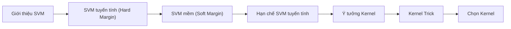

# Tóm tắt điều chỉnh chính  
Báo cáo này đề xuất cải tiến luồng nội dung và cách diễn đạt cho phần thuyết trình về SVM (Support Vector Machine), nhằm khắc phục các chỗ khó hiểu và thiếu nhất quán. Các lỗi thường gặp được nhận diện gồm: thuật ngữ chưa thống nhất (ví dụ “Điểm tựa quyết định” thay vì “vectơ hỗ trợ”), logic nhảy (thuyết trình quá nhanh các khái niệm phức tạp), quá nhiều chữ trên slide, thiếu giải thích công thức và minh hoạ trực quan (hình ảnh/đồ thị). Các đề xuất bao gồm: tái cấu trúc theo luồng logic từ cơ bản đến nâng cao, viết lại câu ngắn gọn, chú thích rõ công thức (hàm tối ưu, ràng buộc, kernel, biên mềm, tham số C và ξ), và bổ sung hình minh hoạ (ví dụ SVM tuyến tính, SVM có lỗi, phép ánh xạ kernel, đường cong phân tách phức tạp). Cuối cùng là thêm sơ đồ luồng (Mermaid) để hình dung cấu trúc trình bày, và bảng so sánh ngắn giữa SVM tuyến tính – SVM kernel – SVM soft-margin. Các câu được viết lại dùng ngôn ngữ rõ ràng, kết hợp tiếng Việt với các thuật ngữ quan trọng bằng tiếng Anh.

## Nhận diện chỗ khó hiểu và lỗi cần sửa  
- **Thuật ngữ mơ hồ, không thống nhất:** Ví dụ, “Support Vectors (Điểm tựa quyết định)” dễ gây nhầm; nên dùng “các vectơ hỗ trợ” hoặc “các điểm nằm trên biên”. Chú thích công thức (kernel, slack) cần giải thích rõ.  
- **Nội dung quá dài, chưa trọng tâm:** Nhiều bullet list viết dài dòng, chưa tách ý rõ ràng. Ví dụ “Đặc trưng rung động phi tuyến” và “phân bố đồng tâm” rất chuyên sâu (liên quan kỹ thuật đo rung ổ lăn), có thể thay bằng ví dụ đơn giản hơn.  
- **Logic nhảy (thiếu kết nối):** Chưa trình bày rõ tại sao cần soft margin (bước chuyển chưa mượt từ hard margin đến việc giới thiệu ξ và C). Cần thêm phần giới thiệu ngắn gọn về công thức SVM (mục tiêu tối ưu) trước khi đưa công thức gốc.  
- **Thiếu hình minh hoạ:** Slide ban đầu đã có hình, nhưng nhiều khái niệm (kernel mapping, soft-margin) vẫn thiếu minh hoạ tương ứng. Cần ít nhất 4 hình/đồ thị như: *siêu phẳng và vectơ hỗ trợ*, *SVM có lỗi/margin mềm*, *phân tách phi tuyến (ví dụ vòng tròn đồng tâm)*, *phép biến đổi kernel (hình 3D)*, hoặc *đường cong phân loại phi tuyến* .  
- **Công thức chưa giải thích:** Khi giới thiệu hàm tối ưu hoặc ràng buộc SVM (hard/soft margin), cần thêm chú thích giải thích (ví dụ: $\xi_i$ là biến slack, $C$ là tham số điều chỉnh phạt) và ý nghĩa từng thành phần.  
- **Quá nhiều chữ:** Slide hiện tại có nhiều chữ và chú thích dài (ví dụ ở slide 1, slide 2), nên rút gọn bullet thành cụm từ ngắn, dễ nhớ.  

## Đề xuất cấu trúc slide (8–10 slides)  
Dưới đây là đề xuất từng slide, mỗi slide gồm tiêu đề ngắn, bullet chính (3–5 ý), ghi chú thuyết trình (1–2 câu), và gợi ý hình/đồ thị.

### Slide 1: Tổng quan về SVM  
- **Tiêu đề:** Khái niệm SVM  
- **Nội dung chính (bullet):**  
  - *Học máy có giám sát:* SVM là một bộ phân lớp tuyến tính tối ưu.  
  - *Tối đa hóa biên (Margin):* Chọn siêu phẳng phân tách hai lớp sao cho khoảng cách đến điểm gần nhất được lớn nhất.  
  - *Vectơ hỗ trợ:* Những điểm nằm sát biên phân tách quyết định vị trí siêu phẳng.  
  - *Ứng dụng:* Phân loại nhị phân, nhận dạng mẫu, v.v. (hay dùng trong chẩn đoán lỗi ổ trục, phân loại ảnh…).  
- **Ghi chú thuyết trình:** SVM (Support Vector Machine) tạo siêu phẳng tối ưu để phân tách hai lớp. Biên an toàn (margin) càng rộng thì độ phân tách càng chắc chắn. Các điểm nằm trên biên (vectơ hỗ trợ) quyết định đường phân tách này.  
- **Hình minh hoạ:**  
   *Hình 1:* Ví dụ SVM tuyến tính (hard-margin) cho hai lớp. Đường kẻ liền là siêu phẳng quyết định, hai đường đứt nét song song là biên (margin) và các vòng tròn khoanh là các vectơ hỗ trợ (hỗ trợ định vị biên).

### Slide 2: Hard-Margin SVM (Siêu phẳng tuyến tính cứng)  
- **Tiêu đề:** SVM tuyến tính (Hard Margin)  
- **Nội dung chính:**  
  - *Giả thiết:* Dữ liệu lý tưởng, hai lớp hoàn toàn tách biệt (tuyến tính).  
  - *Hàm tối ưu:* Tối thiểu $\frac{1}{2}\|w\|^2$ (tương đương tối đa hóa $1/\|w\|$, tức mở rộng biên).  
  - *Ràng buộc:* Mỗi điểm $i$ thỏa $y_i(w^T x_i + b)\ge 1$; nghĩa là mọi điểm đều nằm ngoài hoặc trên biên.  
  - *Ý nghĩa:* Hướng $(w,b)$ đơn giản nhất (có $\|w\|$ nhỏ) sao cho không có điểm nào bị vi phạm.  
- **Ghi chú thuyết trình:** Hard-margin SVM yêu cầu phân tách tuyệt đối, không cho phép lỗi (slack $\xi_i=0$). Điều này chỉ khả thi khi dữ liệu thật sự tách tuyến tính. Mục tiêu tối ưu là tìm $w,b$ sao cho $\min_i y_i(w^T x_i+b)=1$ và $\|w\|^2$ nhỏ nhất.  
- **Hình minh hoạ:** Có thể tái sử dụng Hình 1 (trên Slide 1) để minh hoạ hard-margin (biên an toàn tối đa, không có điểm rớt vào biên).

### Slide 3: Soft-Margin SVM (Siêu phẳng mềm, có lỗi)  
- **Tiêu đề:** SVM mềm (Cho phép sai số)  
- **Nội dung chính:**  
  - *Vấn đề:* Dữ liệu thực tế thường **không tách tuyến tính** (có nhiễu/ngoại lệ). Hard-margin sẽ ép biên quá hẹp hoặc không có nghiệm.  
  - *Giải pháp:* Giới thiệu biến slack $\xi_i\ge0$ cho phép các điểm vi phạm biên. Mục tiêu thêm hạng mục phạt cho tổng $\sum_i \xi_i$.  
  - *Hàm tối ưu (công thức):* 
    $$
    \min_{w,b,\xi} \; \frac{1}{2}\|w\|^2 + C \sum_i \xi_i, 
    \quad \text{thỏa } y_i(w^T x_i + b)\ge 1 - \xi_i.
    $$ 
    (Giải thích: $C$ điều chỉnh độ nghiêm khắc; $\xi_i$ là độ lệch của điểm $i$ so với biên.)  
  - *Ảnh hưởng của $C$:* $C$ lớn → phạt nặng lỗi (margin hẹp, dễ overfit); $C$ nhỏ → phạt nhẹ (margin rộng, dễ underfit).  
- **Ghi chú thuyết trình:** Soft-margin SVM cho phép một số điểm “rơi vào” trong khoảng biên hoặc phân loại sai, bằng cách thêm biến $\xi_i$ vào ràng buộc. Tham số $C$ cân bằng giữa mong muốn có biên rộng (tức $\|w\|$ nhỏ) và số điểm vi phạm (tổng $\xi_i$). Ví dụ: giá trị $C$ nhỏ giống như cho phép nhiều lỗi (underfitting), còn $C$ lớn phạt lỗi nghiêm ngặt hơn (overfitting).  
- **Hình minh hoạ:** Có thể vẽ đồ thị minh hoạ soft-margin (ví dụ các điểm chồng lấn, điểm vi phạm đổ màu hoặc có dấu $\xi>0$), tuy slide ban đầu đã có hình minh hoạ kèm chú thích.  

### Slide 4: Giới hạn của SVM tuyến tính  
- **Tiêu đề:** Khi SVM tuyến tính bất lực  
- **Nội dung chính:**  
  - *Hạn chế:* Yêu cầu tuyến tính nghĩa là tồn tại siêu phẳng phân tách hai lớp. Nhiều dữ liệu thực tế (như phân bố đồng tâm, XOR, half-moon) không thỏa điều kiện này.  
  - *Ví dụ:* Dữ liệu vòng tròn đồng tâm – lớp trong nằm giữa, lớp ngoài bao quanh. Không có đường thẳng nào phân chia hoàn hảo.  
  - *Hậu quả:* Dùng SVM tuyến tính cho dữ liệu phi tuyến dẫn đến sai phân loại rất cao.  
  - *Kết luận:* Cần phép biến đổi không gian (phi tuyến) để áp dụng SVM tuyến tính hiệu quả.  
- **Ghi chú thuyết trình:** Với dữ liệu phân bố phức tạp, ví dụ các lớp giao nhau hoặc đồng tâm, siêu phẳng tuyến tính đơn giản không thể tách chính xác. Vì vậy, cần phép ánh xạ lên không gian có chiều cao hơn, để một siêu phẳng mới có thể phân tách được dữ liệu.  
- **Hình minh hoạ:**  
   *Hình 2:* So sánh SVM tuyến tính vs phi tuyến. Trái: dữ liệu có thể tách bằng đường thẳng (Linear SVM). Phải: dữ liệu đồng tâm (Một lớp nằm trong vòng tròn của lớp kia), chỉ có SVM phi tuyến (ví dụ kernel) mới phân tách được.

### Slide 5: Ý tưởng Kernel – Tăng chiều dữ liệu  
- **Tiêu đề:** Phép biến đổi Kernel (Map dữ liệu)  
- **Nội dung chính:**  
  - *Ánh xạ không gian:* Đưa dữ liệu từ không gian gốc $x\in\mathbb{R}^p$ vào không gian đặc trưng cao chiều $\Phi(x)\in\mathbb{R}^P$ (có thể P lớn hoặc vô hạn).  
  - *Ví dụ minh hoạ:* Với bài toán vòng tròn: $\Phi(x,y)=(x, y, z=x^2+y^2)$ – thêm chiều $z$ bằng bình phương khoảng cách tới gốc.  
  - *Kết quả:* Trong không gian 3D, hai lớp phân tách tốt bằng một mặt phẳng (ví dụ $z=c$). Khi chiếu ngược về 2D, ta có biên cong hình tròn.  
  - *Kết luận:* Kernel cho phép xử lý phi tuyến bằng cách tìm siêu phẳng trong không gian cao chiều, tương đương biên cong trong không gian gốc.  
- **Ghi chú thuyết trình:** Thay vì trực tiếp tìm đường cong phân tách trong 2D, ta dùng hàm ánh xạ φ để “nâng” dữ liệu lên không gian 3D. Ví dụ φ(x,y)=(x,y,x²+y²) biến vấn đề vòng tròn thành phân tách bằng mặt phẳng trong 3D. Mặt phẳng này khi chiếu ngược về 2D sẽ là biên cong (ví dụ đường tròn) phân tách hai lớp.  
- **Hình minh hoạ:**  
   *Hình 3:* Ví dụ SVM phi tuyến với kernel RBF cho dữ liệu hai vòng đồng tâm. SVM tuyến tính (trái) không phân tách được; SVM với RBF (phải) tạo biên cong (màu nâu/trắng) tách hai lớp.

### Slide 6: Kernel Trick – Tính toán hiệu quả  
- **Tiêu đề:** Mẹo Kernel (kernel trick)  
- **Nội dung chính:**  
  - *Vấn đề:* Tính $\Phi(x)$ cho không gian rất cao chiều (even vô hạn) tốn bộ nhớ và thời gian.  
  - *Quan sát:* Thuật toán SVM chỉ cần tính tích vô hướng $\Phi(x_i)^T \Phi(x_j)$ giữa các điểm, không cần biết biểu diễn $\Phi(x)$ cụ thể.  
  - *Hàm kernel:* Định nghĩa $k(x_i, x_j)=\Phi(x_i)^T \Phi(x_j)$. Ta tính trực tiếp $k(x,z)$ từ tọa độ gốc mà không cần ánh xạ tường minh.  
  - *Ví dụ:* Kernel đa thức bậc 2: $k(x,z)=(x^T z + 1)^2$ tương đương ánh xạ sang $(x_1^2, x_2^2, \sqrt{2} x_1x_2, \sqrt{2}x_1, \sqrt{2}x_2,1)$.  
- **Ghi chú thuyết trình:** Kernel trick cho phép chúng ta làm việc trong không gian cao chiều một cách gián tiếp. Với kernel $k(x,z)$, SVM chỉ cần tính $k(x_i,x_j)$ thay vì $\Phi(x_i)\cdot \Phi(x_j)$. Nhờ vậy, ta tránh phải lưu trực tiếp vectơ $\Phi(x)$ cồng kềnh. Ví dụ, kernel đa thức bậc 2 cho dữ liệu 2 chiều tính nhanh chỉ bằng phép nhân cơ bản mà vẫn tương đương mô tả biến đổi sang 5 chiều.  
- **Hình minh hoạ:**  
   *Hình 4:* Ví dụ biên phân tách do SVM với kernel phi tuyến. Trái: Kernel đa thức bậc 3 (biên cong phức), Phải: Kernel RBF (biên mềm cong). Cả hai đều tách được vùng half-moon (poly) hoặc vòng tròn (RBF) mà SVM tuyến tính không làm được.

### Slide 7: Chọn Kernel và Tối ưu hóa tham số  
- **Tiêu đề:** Chọn kernel & điều chỉnh tham số  
- **Nội dung chính:**  
  - *Lời khuyên:* Bắt đầu với kernel RBF (Gaussian): linh hoạt, thường là mặc định tốt cho nhiều bài toán.  
  - *Tham số γ (gamma) của RBF:* Kiểm soát ảnh hưởng của mỗi điểm. Gamma lớn → chỉ các điểm rất gần ảnh hưởng (biên uốn lượn nhiều). Gamma nhỏ → ảnh hưởng rộng (biên mịn).  
  - *Tham số C:* Đã đề cập ở slide Soft-margin. C lớn → margin chặt (phạt lỗi cao), C nhỏ → margin rộng (tolerate lỗi).  
  - *Tối ưu hóa:* Dùng Grid Search kết hợp Cross-Validation để chọn $(C,\gamma)$ tốt nhất cho dữ liệu cụ thể.  
  - *So sánh nhanh:*   
    | Kernel  | Công thức | Khi dùng                    | Ưu điểm           | Nhược điểm        |  
    | :------ | :-------- | :---------------------------| :---------------- | :---------------- |  
    | **Linear** | $k(x,z)=x^Tz$  | Dữ liệu hầu như tuyến tính, hoặc n_feature >> n_samples. | Đơn giản, nhanh      | Không xử lý phi tuyến  |  
    | **RBF**    | $k(x,z)=\exp(-\gamma\|x-z\|^2)$ | Dữ liệu chung (thường dùng mặc định)    | Linh hoạt, tách phi tuyến tốt | Cần điều chỉnh $\gamma, C$  |  
    | **Poly**   | $k(x,z)=(x^Tz+1)^d$    | Nếu biết có mối quan hệ đa thức | Mô tả tốt dữ liệu đa thức | Chọn bậc $d$ khó, tính toán |  
- **Ghi chú thuyết trình:** Thông thường ta chọn RBF làm kernel mặc định vì nó điều chỉnh linh hoạt ranh giới phân tách. Tham số $\gamma$ của RBF tương đương độ rộng ảnh hưởng của mỗi mẫu. Kết hợp grid-search với cross-validation để tìm $(C,\gamma)$ tối ưu. Bảng trên so sánh sơ bộ các kernel phổ biến (chi tiết hơn có thể tham khảo sách ML).  
- **Hình minh hoạ:** Có thể thêm hình minh hoạ sự khác biệt biên phân tách (ví dụ plot ranh giới với kernel tuyến tính vs RBF) hoặc đường cong ROC; nhưng hình ở Slide 6 hiện có thể đủ minh hoạ.

### Slide 8: Kết luận và Ứng dụng  
- **Tiêu đề:** Kết luận và ứng dụng  
- **Nội dung chính:**  
  - *Tóm tắt:* SVM tối ưu hoá biên giúp phân tách dữ liệu tốt khi chọn kernel phù hợp.  
  - *Ưu điểm:* Khả năng tổng quát hoá cao (max-margin), hiệu quả trong không gian nhiều chiều, sử dụng ít mẫu làm tham số (các vectơ hỗ trợ).  
  - *Hạn chế:* Cần chọn kernel và tham số cẩn thận; không cung cấp xác suất trực tiếp.  
  - *Ứng dụng:* Rất phổ biến trong nhận dạng mẫu (hình ảnh, giọng nói), chẩn đoán y sinh học, bảo trì máy móc, phân loại văn bản, v.v. (SVM được sử dụng trong Kaggle competitions và công nghiệp nhờ độ chính xác cao).  
- **Ghi chú thuyết trình:** SVM là công cụ mạnh cho phân lớp nhị phân, đặc biệt khi có nhiều chiều dữ liệu hay cần biên phân tách rõ. Để đạt hiệu quả cao, cần điều chỉnh kernel và tham số cho phù hợp bài toán. Kết quả phân loại của SVM thường bền vững và ít lệ thuộc vào nhiễu nếu margin được tối ưu tốt.  
- **Hình minh hoạ:** Nếu cần, có thể dùng sơ đồ luồng/đường cong ROC mô phỏng so sánh SVM với các thuật toán khác (tuy tuỳ yêu cầu cụ thể, có thể không cần thêm).

### Sơ đồ luồng logic (Mermaid)  

### Bảng so sánh SVM tuyến tính vs Kernel vs Soft-margin  

| Loại SVM           | Mục tiêu (phi tuyến)                 | Ưu điểm                                            | Nhược điểm                            | Khi dùng                                   |
| :----------------- | :----------------------------------- | :------------------------------------------------- | :------------------------------------ | :----------------------------------------- |
| **Linear (cứng)**  | Tối đa hoá biên phân cách dữ liệu | Đơn giản, nhanh với dữ liệu tách tuyến tính; ít tham số. | Không xử lý được dữ liệu phi tuyến; rất nhạy với ngoại lệ. | Dữ liệu gần như phân tách hoàn toàn bằng đường thẳng. |
| **Kernel (phi)**   | Tạo biên phân cách phi tuyến bằng ánh xạ cao chiều | Mở rộng cho bài toán phi tuyến; linh hoạt qua các hàm kernel khác nhau. | Tính toán phức tạp hơn, phải chọn kernel và tham số; có thể tốn tài nguyên nếu kernel quá lớn. | Dữ liệu có cấu trúc phi tuyến, muốn nắm lấy quan hệ phức tạp.       |
| **Soft-margin**    | Cho phép vi phạm biên (cộng biến slack $\xi_i$) | Bền vững với nhiễu và ngoại lệ; tránh overfitting khi dữ liệu có nhiễu. | Cần điều chỉnh tham số $C$ cẩn thận; nếu không, có thể underfit hoặc overfit. | Dữ liệu thực tế thường có nhiễu, không thể phân tách tuyệt đối.     |

**Ví dụ viết lại câu mẫu (trước và sau sửa):**  
- *Trước:* “Các điểm sát đường biên margin trực tiếp định vị đường phân tách.”  
  *Sau:* “Các điểm sát hai bên biên phân tách (vectơ hỗ trợ) quyết định vị trí siêu phẳng phân chia hai lớp.”  
- *Trước:* “Dữ liệu thực tế luôn có nhiễu… Nhiễu cảm biến, tải biến động…”  
  *Sau:* “Dữ liệu thực tế thường không tách biệt: các lớp có thể giao thoa do nhiễu hoặc biến động trong quá trình thu thập.”  
- *Trước:* “Chấp nhận một vài điểm lấn làn để giữ biên quyết định rộng.”  
  *Sau:* “Cho phép một số điểm không thỏa ràng buộc phân lớp (ξ>0) để đổi lấy biên phân tách rộng hơn.”  
- *Trước:* “Giống như ... dựng hàng rào ... hành lang càng rộng thì càng an toàn.”  
  *Sau:* “Tự hỏi: bạn muốn hàng rào quanh khu vực càng an toàn (biên rộng) hay bao bọc nghiêm ngặt từng chỗ hở (biên hẹp)?”  

**Nguồn tham khảo:** Nội dung được tham khảo từ sách/gần sách ML (Vapnik, Bishop), các giáo trình và tài liệu chính thức như Wikipedia về SVM và tài liệu scikit-learn để đảm bảo đúng đắn thuật toán.  

