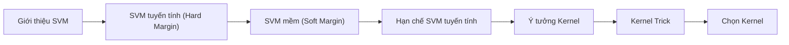

## SLIDE 2: SVM tuyến tính (Hard Margin)

**[CỘT TRÁI / NỘI DUNG CHÍNH]**

Tiêu đề phụ: **Đường biên phân tách tuyệt đối không sai số** (#C00000)

- **Giả thiết lý tưởng**
  Hai lớp dữ liệu (bình thường và lỗi) hoàn toàn tách biệt tuyến tính.
- **Tối thiểu hóa độ dài $w$**
  Công thức tối ưu: $\min_{w,b} \frac{1}{2}\|w\|^2$ giúp mở rộng biên an toàn lớn nhất.
- **Ràng buộc cứng không lỗi**
  Ràng buộc: $y_i(w^T x_i + b) \ge 1$ với mọi điểm dữ liệu $i$.
- **Giải thích ký hiệu**
  $w, b$ là trọng số và độ lệch siêu phẳng; $y_i \in \{-1, 1\}$ là nhãn lớp.

💡 Ghi chú thực tế: Thiết kế ranh giới nghiêm ngặt trong nhà máy, cấm tuyệt đối mọi sự xâm nhập.

**[CỘT PHẢI / HÌNH]**
→ Xem file: slide1_hard_margin.png

---
## SLIDE 3: SVM mềm (Soft Margin)

**[CỘT TRÁI / NỘI DUNG CHÍNH]**

Tiêu đề phụ: **Cho phép sai số để nâng cao hiệu quả** (#C00000)

- **Dữ liệu thực tế có nhiễu**
  Các lớp thường giao thoa do nhiễu cảm biến hoặc biến động tải.
- **Biến slack $\xi_i$ (độ trễ)**
  Cho phép một số điểm vi phạm ràng buộc phân lớp ($\xi_i > 0$).
- **Hàm tối ưu biên mềm**
  $\min_{w,b,\xi} \frac{1}{2}\|w\|^2 + C \sum_i \xi_i$ thỏa $y_i(w^T x_i + b) \ge 1 - \xi_i$.
- **Tham số phạt $C$**
  Cân bằng giữa tối đa hóa biên và giảm thiểu sai số phạt.

Bảng so sánh tác động của tham số C:

| Siêu tham số C | Biên an toàn (Margin) | Điểm chấp nhận lỗi | Nguy cơ |
| :--- | :--- | :--- | :--- |
| **C lớn** (Nghiêm khắc) | Hẹp hơn | Ít hơn | Học tủ (Overfitting) |
| **C nhỏ** (Khoan dung) | Rộng hơn | Nhiều hơn | Học nông (Underfitting) |

💡 Ghi chú thực tế: Tự hỏi: Bạn muốn hàng rào an toàn rộng nhưng có kẽ hở, hay bọc sát sạt từng ngóc ngách?

**[CỘT PHẢI / HÌNH]**
→ Xem file: slide2_soft_margin.png

---
## SLIDE 4: Khi SVM tuyến tính bất lực

**[CỘT TRÁI / NỘI DUNG CHÍNH]**

Tiêu đề phụ: **Giới hạn của đường phân chia thẳng** (#C00000)

- **Bài toán phi tuyến thực tế**
  Dữ liệu thực tế thường phân bố xen kẽ phức tạp hoặc đồng tâm.
- **Ví dụ phân bố đồng tâm**
  Lớp bình thường ở tâm, lớp lỗi bao quanh; không thể tách bằng đường thẳng.
- **Hậu quả phân loại sai**
  Cố dùng đường thẳng phân chia dữ liệu phi tuyến dẫn đến sai số lớn.
- **Lối ra cho thuật toán**
  Cần đưa dữ liệu vào không gian mới để phân tách tuyến tính.

💡 Ghi chú thực tế: Giống như mạt sắt và hạt cát trộn lẫn đồng tâm trên khay, không thể dùng thước gạt riêng.

**[CỘT PHẢI / HÌNH]**
→ Xem file: slide3_nonlinear_problem.png

---
## SLIDE 5: Phép biến đổi Kernel

**[CỘT TRÁI / NỘI DUNG CHÍNH]**

Tiêu đề phụ: **Nâng chiều dữ liệu để tìm lối thoát** (#C00000)

- **Ánh xạ không gian $\Phi(x)$**
  Đưa dữ liệu từ không gian thấp chiều sang không gian cao chiều hơn.
- **Ví dụ nâng lên 3 chiều**
  Thêm chiều $z = x_1^2 + x_2^2$ bằng khoảng cách tới gốc tọa độ.
- **Phân tách tuyến tính trong 3D**
  Hai lớp đồng tâm nay được phân tách dễ dàng bằng một mặt phẳng.
- **Chiếu ngược về 2D**
  Mặt phẳng cắt trong 3D tương đương biên phân chia dạng tròn ở 2D.

💡 Ghi chú thực tế: Giống như thổi luồng khí để nâng bóng nhựa nhẹ bay lên cao, tách khỏi đá nặng bên dưới.

**[CỘT PHẢI / HÌNH]**
→ Xem file: slide4_kernel_idea.png

---
## SLIDE 6: Mẹo Kernel (Kernel Trick)

**[CỘT TRÁI / NỘI DUNG CHÍNH]**

Tiêu đề phụ: **Giải pháp tính toán gián tiếp siêu tốc** (#C00000)

- **Thách thức bộ nhớ và thời gian**
  Tính trực tiếp tọa độ $\Phi(x)$ trong không gian vô hạn chiều là bất khả thi.
- **Tính toán qua tích vô hướng**
  Mô hình SVM chỉ cần tích vô hướng $\Phi(x_i)^T \Phi(x_j)$ để hoạt động.
- **Định nghĩa hàm Kernel $k(x, z)$**
  Tính trực tiếp tích vô hướng từ tọa độ gốc: $k(x, z) = \Phi(x)^T \Phi(z)$.
- **Ví dụ Kernel đa thức bậc 2**
  Công thức $(x^T z + 1)^2$ tính siêu nhanh nhưng tương đương không gian 6 chiều.

💡 Ghi chú thực tế: Giống như tra cứu khoảng cách trên bảng bản đồ thay vì phải mang thước đi đo thực địa.

**[CỘT PHẢI / HÌNH]**
→ Xem file: slide5_kernel_trick.png

---
## SLIDE 7: Chọn Kernel & điều chỉnh tham số

**[CỘT TRÁI / NỘI DUNG CHÍNH]**

Tiêu đề phụ: **Tìm cấu hình tối ưu cho mô hình** (#C00000)

- **Lựa chọn mặc định RBF**
  Kernel RBF (Gaussian) rất linh hoạt, khuyên dùng trước tiên cho dữ liệu rung.
- **Ý nghĩa tham số $\gamma$ (Gamma)**
  Gamma lớn biên uốn lượn (dễ overfit); gamma nhỏ biên mịn hơn (dễ underfit).
- **Tối ưu siêu tham số**
  Tìm cặp $(C, \gamma)$ tốt nhất bằng Grid Search và Cross-Validation.

Bảng so sánh các hàm Kernel:

| Kernel | Công thức | Khi dùng | Ưu điểm | Nhược điểm |
| :--- | :--- | :--- | :--- | :--- |
| **Linear** | $k(x,z) = x^T z$ | Dữ liệu tuyến tính | Nhanh, đơn giản | Không phân tách phi tuyến |
| **RBF** | $k(x,z) = \exp(-\gamma\|x-z\|^2)$ | Dữ liệu chung | Rất linh hoạt | Phải chỉnh kỹ $C$ và $\gamma$ |
| **Poly** | $k(x,z) = (x^T z + 1)^d$ | Quan hệ đa thức | Mô tả đa thức tốt | Khó chọn bậc $d$ tối ưu |

💡 Ghi chú thực tế: Gamma nhỏ giống nhìn từ xa thấy biên giới phẳng; gamma lớn giống nhìn quá gần biên uốn lượn.

**[CỘT PHẢI / HÌNH]**
→ Xem file: slide6_kernel_comparison.png

---
## SLIDE 8: Kết luận và Ứng dụng

**[CỘT TRÁI / NỘI DUNG CHÍNH]**

Tiêu đề phụ: **Đánh giá tổng quan giải pháp SVM** (#C00000)

- **Khả năng tổng quát hóa cao**
  Nhờ tối đa hóa biên giúp thuật toán bền vững trước dữ liệu nhiễu.
- **Tiết kiệm mẫu huấn luyện**
  Mô hình chỉ phụ thuộc các vectơ hỗ trợ, giảm thiểu tài nguyên tính.
- **Hạn chế chính**
  Không cung cấp trực tiếp xác suất; nhạy cảm với việc chọn tham số.
- **Ứng dụng chẩn đoán lỗi**
  Triển khai giám sát tự động lỗi ổ lăn, phân loại bất thường thiết bị.

💡 Ghi chú thực tế: Giống người bảo vệ có kinh nghiệm, chỉ nhớ vài điểm nghi vấn then chốt để canh phòng cả nhà máy.

**[CỘT PHẢI / HÌNH]**
→ Xem file: slide8_summary.png

---

## PHẦN PHỤ LỤC: TỔNG KẾT & SO SÁNH TRỰC QUAN

### Sơ đồ tiến trình phát triển và hoàn thiện thuật toán SVM (Mermaid)

### Bảng so sánh SVM tuyến tính vs Kernel vs Soft-margin

| Loại SVM | Mục tiêu (phi tuyến) | Ưu điểm | Nhược điểm | Khi dùng |
| :--- | :--- | :--- | :--- | :--- |
| **Linear (cứng)** | Tối đa hoá biên phân cách dữ liệu | Đơn giản, nhanh với dữ liệu tách tuyến tính; ít tham số. | Không xử lý được dữ liệu phi tuyến; rất nhạy với ngoại lệ. | Dữ liệu gần như phân tách hoàn toàn bằng đường thẳng. |
| **Kernel (phi)** | Tạo biên phân cách phi tuyến bằng ánh xạ cao chiều | Mở rộng cho bài toán phi tuyến; linh hoạt qua các hàm kernel khác nhau. | Tính toán phức tạp hơn, phải chọn kernel và tham số; có thể tốn tài nguyên nếu kernel quá lớn. | Dữ liệu có cấu trúc phi tuyến, muốn nắm lấy quan hệ phức tạp. |
| **Soft-margin** | Cho phép vi phạm biên (cộng biến slack $\xi_i$) | Bền vững với nhiễu và ngoại lệ; tránh overfitting khi dữ liệu có nhiễu. | Cần điều chỉnh tham số $C$ cẩn thận; nếu không, có thể underfit hoặc overfit. | Dữ liệu thực tế thường có nhiễu, không thể phân tách tuyệt đối. |
